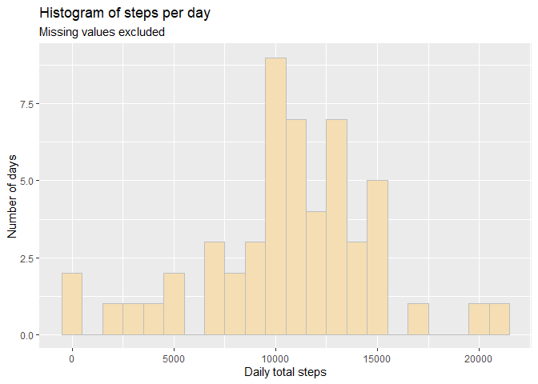
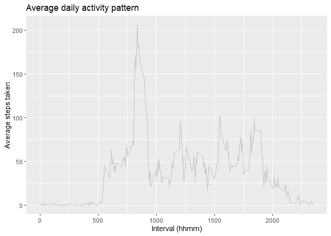
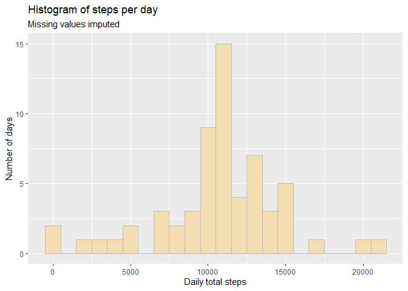
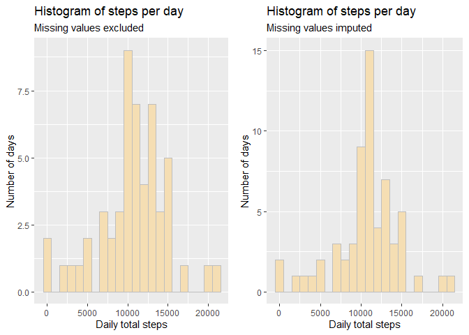
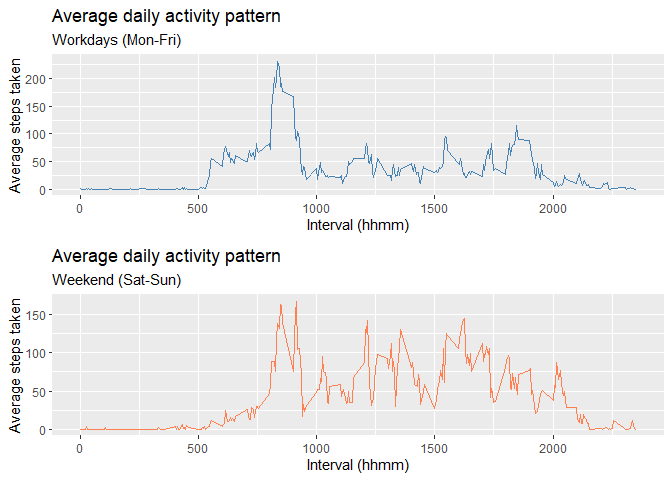
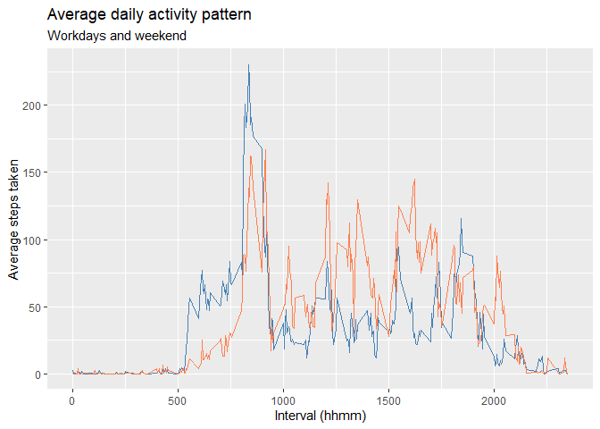

<strong><p style="color: red">
******* IMPORTANT NOTE TO PEER REVIEWERS *******<br/><br/>
The generated markdown file (.md) does not render correctly in GitHub.<br/>
i) ToC is missing, ii) Internal links do not work.<br/><br/>
I ask please that you either open the .html file in your browser or view the .md
file in RStudio.<br/><br/>
Thank you
</p></strong>


## Introduction
This assignment is intended to demonstrate a basic understanding of Reproducible Research principles using the tools R Markdown and knitr to generate a single document artifact (as html) that includes text, code and plots created during the course of the 'research'.

### Data

* Dataset: [Activity monitoring data](https://d396qusza40orc.cloudfront.net/repdata%2Fdata%2Factivity.zip) [52K]

It includes the following variables:

* `steps`: Number of steps taking in a 5-minute interval (missing
    values are coded as `NA`)
* `date`: The date on which the measurement was taken in YYYY-MM-DD format
* `interval`: Identifier for the 5-minute interval when measurement was recorded

We need the following libraries:

``` r
library(ggplot2)
library(dplyr, quietly=TRUE)
```

```
## 
## Attaching package: 'dplyr'
```

```
## The following objects are masked from 'package:stats':
## 
##     filter, lag
```

```
## The following objects are masked from 'package:base':
## 
##     intersect, setdiff, setequal, union
```

``` r
library(stringr)
library(kableExtra)
```

```
## 
## Attaching package: 'kableExtra'
```

```
## The following object is masked from 'package:dplyr':
## 
##     group_rows
```

``` r
library(cowplot)
```
### Loading and preprocessing the data
<div style="text-align: right;">[top](#TOC)</div>

No need to download the dataset. It already exists as a zip file in the working directory.

``` r
unzip("activity.zip")
activity <- read.table("./activity.csv", sep=",", header = TRUE)
str(activity)
```

```
## 'data.frame':	17568 obs. of  3 variables:
##  $ steps   : int  NA NA NA NA NA NA NA NA NA NA ...
##  $ date    : chr  "2012-10-01" "2012-10-01" "2012-10-01" "2012-10-01" ...
##  $ interval: int  0 5 10 15 20 25 30 35 40 45 ...
```

``` r
summary(activity)
```

```
##      steps            date              interval     
##  Min.   :  0.00   Length:17568       Min.   :   0.0  
##  1st Qu.:  0.00   Class :character   1st Qu.: 588.8  
##  Median :  0.00   Mode  :character   Median :1177.5  
##  Mean   : 37.38                      Mean   :1177.5  
##  3rd Qu.: 12.00                      3rd Qu.:1766.2  
##  Max.   :806.00                      Max.   :2355.0  
##  NA's   :2304
```

## Assignment Questions

### Question 1
<div style="text-align: right;">[top](#TOC)</div>

>*"What is the mean total number of steps taken per day?"*


Group and summarize the `activity` dataset to show daily total steps. Missing values are omitted.


``` r
daily_steps <- summarize(group_by(na.omit(activity), date), steps = sum(steps))
```

Generate a histogram that shows the frequency (number of days) of daily steps taken. Bin width is 1000.


``` r
hist_q1 <- ggplot(daily_steps, aes(x=steps)) +
               geom_histogram(binwidth = 1000, color = "gray", fill = "wheat") +
               labs(x = "Daily total steps",
                    y = "Number of days",
                    title = "Histogram of steps per day",
                    subtitle = "Missing values excluded")
hist_q1
```

<!-- -->

Create a results dataset that shows the calculated mean and median values of total daily steps for the `daily_steps` table.

``` r
results_table <- data.frame(Dataset=c("NA Omitted", ""),
                            Calculation=c("Mean", "Median"),
                            Value=c(format(mean(daily_steps$steps), nsmall = 3),
                                    format(median(daily_steps$steps), nsmall = 3))
                            )
```

The table below shows the result calculations.


``` r
results_table %>% kbl() %>% kable_material(c("striped"))
```

<table class=" lightable-material lightable-striped" style='font-family: "Source Sans Pro", helvetica, sans-serif; margin-left: auto; margin-right: auto;'>
 <thead>
  <tr>
   <th style="text-align:left;"> Dataset </th>
   <th style="text-align:left;"> Calculation </th>
   <th style="text-align:left;"> Value </th>
  </tr>
 </thead>
<tbody>
  <tr>
   <td style="text-align:left;"> NA Omitted </td>
   <td style="text-align:left;"> Mean </td>
   <td style="text-align:left;"> 10766.189 </td>
  </tr>
  <tr>
   <td style="text-align:left;">  </td>
   <td style="text-align:left;"> Median </td>
   <td style="text-align:left;"> 10765 </td>
  </tr>
</tbody>
</table>

---

### Question 2
<div style="text-align: right;">[top](#TOC)</div>

> *"What is the average daily activity pattern?"*


Group the `activity` dataset by interval and calculate the average steps taken for each interval.

``` r
interval_steps_mean <- summarize(group_by(na.omit(activity), interval), steps = mean(steps))
```

Generate a line chart that shows the average number of steps taken for each interval across the entire measurement period.


``` r
ggplot(interval_steps_mean, aes(x=interval, y=steps)) +
    geom_line(linewidth = 0.5, color = "gray", linetype=1) +
    labs(x = "Interval (hhmm)",
         y = "Average steps taken",
         title = "Average daily activity pattern")
```

<!-- -->

Find the interval that contains the maximum average number of steps taken.

``` r
ms <- interval_steps_mean %>% filter(steps==max(steps))
```


The maximum steps average is **206** at **0835**.

---

### Question 3
<div style="text-align: right;">[top](#TOC)</div>

>*"Imputing missing values"*

Get a count of observations in the `activity` dataset that have missing values.
Checking *all* columns for missing values (making no assumptions here).

``` r
na_steps <- sum(is.na(activity$steps))
na_date <- sum(is.na(activity$date))
na_interval <- sum(is.na(activity$interval))
```

There are **2304** observations with missing values in the `steps` column.<br/>
There are **0** observations with missing values in the `date` column.<br/>
There are **0** observations with missing values in the `interval` column.<br/>

**Strategy for imputing missing values**

- We are only concerned with the `steps` column.  There are no missing values in any of the other columns.
- Missing values will be replaced with the corresponding (same `interval`)
`steps` average. The required lookup dataset has already been generated in Question 2 above: `interval_steps_mean`.

1. Replace missing values
   - Make a copy of the original dataset -> `nona_activity`.
   - Loop through `nona_activity`. When an observation with missing value is found, replace the missing value with the average `steps` value for the corresponding `interval`.  
   - The dataset copy now has all missing values replaced.


``` r
nona_activity <- activity

for (i in 1:nrow(nona_activity)){
    if (is.na(nona_activity[i,1])){
        nona_activity[i,1] <- interval_steps_mean[interval_steps_mean$interval == nona_activity[i,3],2]
        }
}
```

The new dataset `nona_activity` has **17568** observations
and there are **0** missing values.

2. Create histogram
   - Group and summarize the `nona_activity` dataset to show daily total steps.
   - Generate a histogram that shows the frequency (number of days) of daily steps taken. Bin width is 1000.


``` r
nona_daily_steps <- summarize(group_by(nona_activity, date), steps = sum(steps))

hist_q3 <- ggplot(nona_daily_steps, aes(x=steps)) +
               geom_histogram(binwidth = 1000, color = "gray", fill = "wheat") +
               labs(x = "Daily total steps",
                    y = "Number of days",
                    title = "Histogram of steps per day",
                    subtitle = "Missing values imputed")
hist_q3
```

<!-- -->

Append (`rbind`)the calculated mean and median values of total daily steps for the `nona_daily_steps` table onto the `results_table` created for Question 1.


``` r
nona_results <- c("NA Imputed", "Mean", format(mean(nona_daily_steps$steps), nsmall = 3))
results_table <- rbind(results_table, nona_results)
nona_results <- c("", "Median", format(median(nona_daily_steps$steps), nsmall = 3))
results_table <- rbind(results_table, nona_results)
```

**Findings**

The table below shows the mean and median values  for both the `daily_steps`
and `nona_daily_steps` datasets.  The mean and median values are almost the same.
The only difference is that in the imputed values dataset the mean and median are identical.


``` r
results_table %>% kbl(digits = 3) %>% kable_material(c("striped"))
```

<table class=" lightable-material lightable-striped" style='font-family: "Source Sans Pro", helvetica, sans-serif; margin-left: auto; margin-right: auto;'>
 <thead>
  <tr>
   <th style="text-align:left;"> Dataset </th>
   <th style="text-align:left;"> Calculation </th>
   <th style="text-align:left;"> Value </th>
  </tr>
 </thead>
<tbody>
  <tr>
   <td style="text-align:left;"> NA Omitted </td>
   <td style="text-align:left;"> Mean </td>
   <td style="text-align:left;"> 10766.189 </td>
  </tr>
  <tr>
   <td style="text-align:left;">  </td>
   <td style="text-align:left;"> Median </td>
   <td style="text-align:left;"> 10765 </td>
  </tr>
  <tr>
   <td style="text-align:left;"> NA Imputed </td>
   <td style="text-align:left;"> Mean </td>
   <td style="text-align:left;"> 10766.189 </td>
  </tr>
  <tr>
   <td style="text-align:left;">  </td>
   <td style="text-align:left;"> Median </td>
   <td style="text-align:left;"> 10766.189 </td>
  </tr>
</tbody>
</table>

A more significant difference is reflected in the 2 histogram y-axes (number of days).  
The NA values are not randomly scattered throughout the original `activity' dataset.
Where they are found, they always cover all intervals of any one day of observation.

Here we list the days where no observations were made.

``` r
ds <- summarize(group_by(activity, date), steps = sum(steps))
ds[is.na(ds$steps),]
```

```
## # A tibble: 8 × 2
##   date       steps
##   <chr>      <int>
## 1 2012-10-01    NA
## 2 2012-10-08    NA
## 3 2012-11-01    NA
## 4 2012-11-04    NA
## 5 2012-11-09    NA
## 6 2012-11-10    NA
## 7 2012-11-14    NA
## 8 2012-11-30    NA
```

8 entire days have no useful observations. So when NA values are omitted (Question 1 `daily_steps`),
there are 53 days of observations.

When NA values are imputed (Question 3 `nona_daily_steps`) we end up with the full complement of
61 days of observations.

The 2 histograms are shown together below - have a look at the y-axes

``` r
plot_grid(hist_q1, hist_q3, ncol = 2)
```

<!-- -->


---

### Question 4
<div style="text-align: right;">[top](#TOC)</div>

>*"Are there differences in activity patterns between weekdays and weekends?"*

We are using the `nona_activity` (imputed values) dataset for this question.

1. Add a new factor variable to split into weekday or weekend observations.


``` r
nona_activity <- mutate(nona_activity, weekday=factor(
                ifelse(weekdays(as.Date(nona_activity$date)) %in% c('Saturday','Sunday'),
                                    'Weekend',
                                    'Workday'
                       )))
```

2. Create 2 datasets
   - split by the new `weekday` factor variable.
   - group by interval across the entire measurement period and calculate the `steps` average.


``` r
work_int_steps_mean <- summarize(group_by(nona_activity[nona_activity$weekday == 'Workday',],
                                 interval), steps = mean(steps))
wend_int_steps_mean <- summarize(group_by(nona_activity[nona_activity$weekday == 'Weekend',],
                                 interval), steps = mean(steps))
```

Generate a line chart that shows the average number of steps taken for each interval across the entire measurement period.

**Method 1:** Show workday and weekend line plots separately in a single graphic.
- Generate each plot and assign to a variable.
- Use `cowplot` function `plot_grid` to arrange the plots into a single graphic.


``` r
work_plot <- ggplot(work_int_steps_mean, aes(x=interval, y=steps)) +
             geom_line(linewidth = 0.5, color = "steelblue", linetype=1) +
             labs(x = "Interval (hhmm)",
                  y = "Average steps taken",
                  title = "Average daily activity pattern",
                  subtitle = "Workdays (Mon-Fri)")

wend_plot <- ggplot(wend_int_steps_mean, aes(x=interval, y=steps)) +
             geom_line(linewidth = 0.5, color = "coral", linetype=1) +
             labs(x = "Interval (hhmm)",
                  y = "Average steps taken",
                  title = "Average daily activity pattern",
                  subtitle = "Weekend (Sat-Sun)")

plot_grid(work_plot, wend_plot, ncol = 1)
```

<!-- -->

**Method 2:** show workday and weekend data as a single multiline graphic. 

``` r
ggplot() + 
    geom_line(data=work_int_steps_mean, aes(x=interval, y=steps), color='steelblue') + 
    geom_line(data=wend_int_steps_mean, aes(x=interval, y=steps), color='coral') +
    labs(x = "Interval (hhmm)",
         y = "Average steps taken",
         title = "Average daily activity pattern",
         subtitle = "Workdays and weekend") +
    scale_color_manual(name='Weekday',
                       labels=c('Workday (Mon-Fri)', 'Weekend (Sat-Sun)'),
                       values=c('steelblue', 'coral'))
```

<!-- -->

<p style="text-align: center;">ooo0ooo</p>
