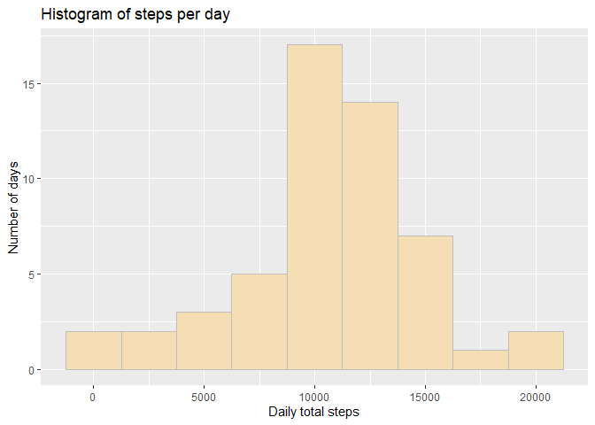

## Introduction
This assignment is intended to demonstrate a basic understanding of Reproducible Research principles using the tools R Markdown and knitr to generate a single document artifact (as html) that includes text, code and plots created during the course of the 'research'.

### Data

* Dataset: [Activity monitoring data](https://d396qusza40orc.cloudfront.net/repdata%2Fdata%2Factivity.zip) [52K]

It includes the following variables:

* **steps**: Number of steps taking in a 5-minute interval (missing
    values are coded as `NA`)
* **date**: The date on which the measurement was taken in YYYY-MM-DD
    format
* **interval**: Identifier for the 5-minute interval in which
    measurement was taken

We need the following libraries:

``` r
library(ggplot2)
library(dplyr)
```

```
## 
## Attaching package: 'dplyr'
```

```
## The following objects are masked from 'package:stats':
## 
##     filter, lag
```

```
## The following objects are masked from 'package:base':
## 
##     intersect, setdiff, setequal, union
```
### Loading and preprocessing the data
No need to download the dataset. It already exists as a zip file in the working directory.

``` r
unzip("activity.zip")
activity <- read.table("./activity.csv", sep=",", header = TRUE)
str(activity)
```

```
## 'data.frame':	17568 obs. of  3 variables:
##  $ steps   : int  NA NA NA NA NA NA NA NA NA NA ...
##  $ date    : chr  "2012-10-01" "2012-10-01" "2012-10-01" "2012-10-01" ...
##  $ interval: int  0 5 10 15 20 25 30 35 40 45 ...
```

``` r
summary(activity)
```

```
##      steps            date              interval     
##  Min.   :  0.00   Length:17568       Min.   :   0.0  
##  1st Qu.:  0.00   Class :character   1st Qu.: 588.8  
##  Median :  0.00   Mode  :character   Median :1177.5  
##  Mean   : 37.38                      Mean   :1177.5  
##  3rd Qu.: 12.00                      3rd Qu.:1766.2  
##  Max.   :806.00                      Max.   :2355.0  
##  NA's   :2304
```

## Assignment Questions

### Q1: What is mean total number of steps taken per day?
Group and summarize the data to show daily total steps. Make a histogram.

``` r
daily_steps <- summarize(group_by(na.omit(activity), date), steps = sum(steps))
ggplot(daily_steps, aes(x=steps)) +
    geom_histogram(binwidth = 2500, color = "gray", fill = "wheat") +
    labs(x = "Daily total steps",
         y = "Number of days",
         title = "Histogram of steps per day")
```

<!-- -->

### Q2: What is the average daily activity pattern?


### Q3: Imputing missing values


### Q4: Are there differences in activity patterns between weekdays and weekends?
