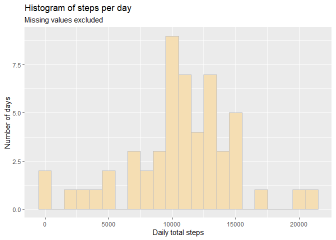
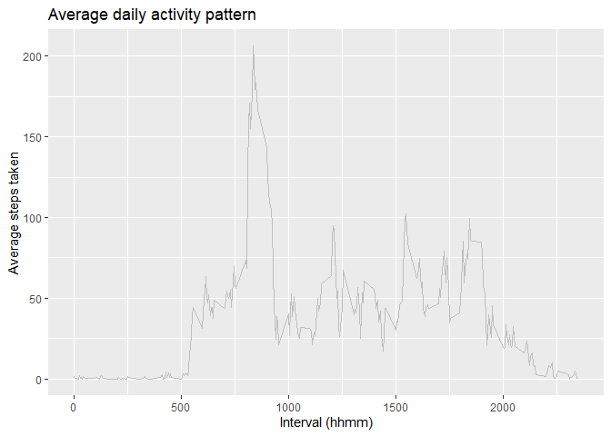
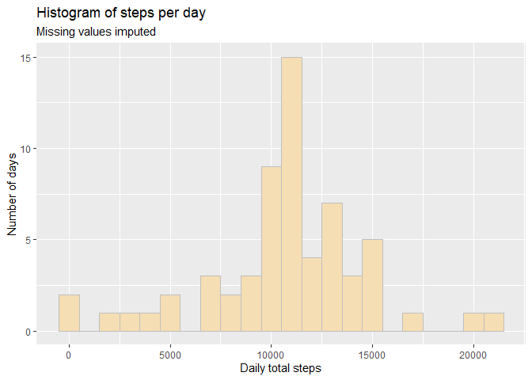

# Reproducible Research: Peer Assessment 1
Slow Learner  
Sunday, Aug 16, 2015  

### Introduction
This assignment is intended to demonstrate a basic understanding of Reproducible Research principles using the tools R Markdown and knitr to generate a single document artifact (as html) that includes text, code and plots created during the course of the 'research'.

### Data

* Dataset: [Activity monitoring data](https://d396qusza40orc.cloudfront.net/repdata%2Fdata%2Factivity.zip) [52K]

It includes the following variables:

* **steps**: Number of steps taking in a 5-minute interval (missing
    values are coded as `NA`)
* **date**: The date on which the measurement was taken in YYYY-MM-DD
    format
* **interval**: Identifier for the 5-minute interval in which
    measurement was taken

### Loading and preprocessing the data
We won't be downloading the dataset. It already exists as a zip file in the working directory.

```r
unzip("activity.zip")
df <- read.table("./activity.csv", sep=",", header = TRUE)
str(df)
```

```
## 'data.frame':	17568 obs. of  3 variables:
##  $ steps   : int  NA NA NA NA NA NA NA NA NA NA ...
##  $ date    : Factor w/ 61 levels "2012-10-01","2012-10-02",..: 1 1 1 1 1 1 1 1 1 1 ...
##  $ interval: int  0 5 10 15 20 25 30 35 40 45 ...
```

```r
summary(df)
```

```
##      steps                date          interval     
##  Min.   :  0.00   2012-10-01:  288   Min.   :   0.0  
##  1st Qu.:  0.00   2012-10-02:  288   1st Qu.: 588.8  
##  Median :  0.00   2012-10-03:  288   Median :1177.5  
##  Mean   : 37.38   2012-10-04:  288   Mean   :1177.5  
##  3rd Qu.: 12.00   2012-10-05:  288   3rd Qu.:1766.2  
##  Max.   :806.00   2012-10-06:  288   Max.   :2355.0  
##  NA's   :2304     (Other)   :15840
```

## Question 1
### What is mean total number of steps taken per day?

The dataset includes 17568 observations. Of these 15264 have complete data.
Observations with missing values are omitted from this part of the assignment.

The following code depends on the *dplyr*  library.

```r
library(dplyr)
```

```
## 
## Attaching package: 'dplyr'
## 
## The following object is masked from 'package:stats':
## 
##     filter
## 
## The following objects are masked from 'package:base':
## 
##     intersect, setdiff, setequal, union
```
- First calculate the total steps taken each day.

```r
daily_steps <- summarise(group_by(na.omit(df), date),
                         steps = sum(steps))
```
- Show a histogram of frequencies of daily steps taken.

```r
hist(daily_steps$steps,
     breaks=8,
     xlab="count of steps taken per day",
     main="Histogram of daily steps taken")
```

 

- Calculate the mean and median of total steps taken each day

```r
mean(daily_steps$steps)
```

```
## [1] 10766.19
```

```r
median(daily_steps$steps)
```

```
## [1] 10765
```


## Question 2
### What is the average daily activity pattern?
Observations with missing values are omitted from this part of the assignment. 
The question requires that the data is grouped by interval.

```r
avg_steps_intv <- summarise(group_by(na.omit(df), interval), steps = mean(steps))
```
Summary data for average steps by interval

```r
summary(avg_steps_intv$steps)
```

```
##    Min. 1st Qu.  Median    Mean 3rd Qu.    Max. 
##   0.000   2.486  34.110  37.380  52.830 206.200
```

Time series plot of average number of steps taken per 5 minute time interval.

```r
plot(avg_steps_intv$steps ~ avg_steps_intv$interval, type="l", col="blue", xlab="Interval", ylab="Average Steps")
```

 

The highest average number of steps taken during any time interval is **206.1698113**.

The corresponding time interval is **835**

## Question 3
### Imputing missing values
All observations are required for this part of the assignment.

```r
sumna <- sum(is.na(df$steps))
```
There are 2304 rows with missing data cells in the *steps*  column.

There is no missing data in the other columns.

```r
sum(is.na(df$interval))
```

```
## [1] 0
```

```r
sum(is.na(df$date))
```

```
## [1] 0
```
#### Strategy
The following strategy is used to fill in missing values in the *steps*  column.

- Missing values shall be replaced with the average *interval*  value across all days for which observations have been recorded. The required dataset has already been generated in Question 2 above: *avg_steps_intv*
- Make a copy of the original dataset
- Loop through the dataset copy. When an observation with missing value is found, replace the missing value with the corresponding average steps value for the corresponding interval.
- The dataset copy now has all missing values replaced.


```r
df_narep <- df
for (i in 1:nrow(df_narep)){
    if (is.na(df_narep[i,1])){
        df_narep[i,1] <- avg_steps_intv[avg_steps_intv$interval == df_narep[i,3],2]
        }
}
```
The new dataset *df_narep*  has 17568 observations and there are 0 missing values.

- Show a histogram of frequencies of daily steps taken. This uses the same method as in Question 1.

```r
daily_steps_narep <- summarise(group_by(df_narep, date),
                         steps = sum(steps))

hist(daily_steps_narep$steps,
     breaks=8,
     xlab="count of steps taken per day",
     main="Histogram of daily steps taken")
```

 

- Calculate the new (NA replaced) mean and median of total steps taken each day

```r
mean(daily_steps_narep$steps)
```

```
## [1] 10766.19
```

```r
median(daily_steps_narep$steps)
```

```
## [1] 10766.19
```

- Old Mean/median values (NA removed)

```r
mean(daily_steps$steps)
```

```
## [1] 10766.19
```

```r
median(daily_steps$steps)
```

```
## [1] 10765
```

The new values (NA replaced) are very similar to the old (NA removed) values. The mean is identical.
The impact of replacing missing values has been to shift the median to be the same as the mean.

## Question 4
### Are there differences in activity patterns between weekdays and weekends?
Create a new factor variable in the dataset with two levels - "weekday" and "weekend" indicating whether a given date is a weekday or weekend day.

```r
df_narep$day <- weekdays(as.Date(df_narep$date), abbreviate=TRUE)
df_narep$wend <- sapply(df_narep$day, function(z) if (z == "Sat" || z == "Sun") z <- factor("weekend") else z <- factor("weekday"))
```

Calculate the average number of steps taken per interval:
- across all weekdays : *avg_wday*
- across all weekends : *avg_wend*

```r
avg_wday <- summarise(group_by(df_narep[df_narep$wend == "weekday",], interval), steps = mean(steps))
avg_wend <- summarise(group_by(df_narep[df_narep$wend == "weekend",], interval), steps = mean(steps))
```
Plot the data

```r
par(mfrow=c(2,1))
plot(avg_wday$steps ~ avg_wday$interval,
     type="l", col="blue",
     xlab="Interval",
     ylab="Average Steps",
     main="Weekdays")
plot(avg_wend$steps ~ avg_wend$interval,
     type="l", col="red",
     xlab="Interval",
     ylab="Average Steps",
     main="Weekends")
```

 

